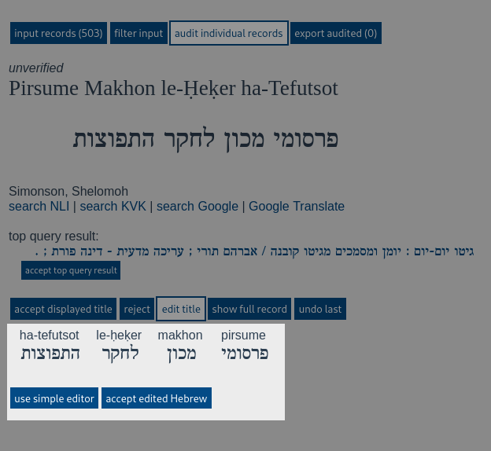

Revrit GUI Auditing Tool
========================

Our Revrit API is useful for automatically converting transliterated
Hebrew titles in your catalog back to the original script.

Once one has this converted data, the GUI auditing tool serves two
purposes:

- It may be used to go over the output so you can have confidence that
  the quality of the conversion is good--that verified titles are
  correct in more than 99% of cases and that unverified conversions
  marked for searchable fields are good enough to serve their purpose.
- It may be used to manually verify or correct titles which could not
  be otherwise verified, so they may be entered into the catalog with
  Hebrew. While this does require human labor, verifying titles with
  our auditing is typically much faster than manually writing out the
  Hebrew ones self.

.. contents::

Data Storage and Privacy
------------------------

To protect your data and privacy, as well as to additional legal and
technical complexity for us, no data sent to the API or audited in the
GUI is ever saved by us. Your auditing session is instead saved in
your browser and loads from this local storage every time you visit
our page. (For the technically curious, this is done with the
seldom-used `Web Storage API`_.)
This means your auditing session will only be available on one 
machine, though you may have different sessions on different
machines. If you are in a remote desktop situation, the session should
be available with the browser from your remote desktop on any client
machine.

.. _Web Storage API:
    https://developer.mozilla.org/en-US/docs/Web/API/Web_Storage_API 

Getting Started
---------------

When you open the editing interface for the first time, you will see a
screen like this:

This is the input tab before any records are loaded. Once you have
loaded records, the screen will change to give you access to the other
parts of the API. You can load a file of API output from your computer
by clicking the *browse* button and selecting the desired file.

Continue reading the section on the input tab to see more about
loading data into the audit tool.

Input Records
-------------

Once some data is loaded, the rest of the audit interface will be
available, but let's continue to look at the input tab for a moment.

You can load data by opening a file from your computer with the
*browse* button, but the webpage may stall if you try to load too many
records at once. I typically limit my input files to 500 records a
peice, but one can normally load several thousand records at once. The
number of records you can load depends on the capabilities of your
computer.

If your files are too large to load, you can also try to copy and
paste smaller portions of the file into the text box, but the input
must contain only complete records. The API output normally comes with
one record on each line, so if you copy from the beginning of your
first line to the end of your last line without anything extra from
the following line, files can be subdivided this way.

If none of these works for you, feel free to contact us and we can
subdivide your data into appropriately sized chunks for you. *This
service may not be available indefinitely.*

At the bottom of the input tab is a button to clear the input. This
action cannot be undone.

Filter Input
------------
Before performing the actual audit, you may wish to filter out records
which are irrelevant to the type of audit you wish to do. The results
of the filter settings only take effect when the *apply filters*
button is pushed.

The default setting, shown here, keeps only those records of the
*unverified* type.

This is because the *verified* results are so frequently correct that
there it is not much need to audit them--though one may do so if they
would like to see the reason for our confidence in these
conversions. The titles which caused errors within the API are also
left out by default, but they can be included as well, at the user's
option.

In addition, we also remove some titles from the audit which we
believe are very unlikely to be Hebrew by default. This option can be
unchecked to allow the titles which do not appear to be Hebrew as
well.

This looks at the characters contained in the title and judges whether
or not they appear to be of the sort used in Hebrew
transliteration. 

    Note: This option is not guaranteed to make the right
    determination in all cases. The heuristics it uses tries to err on
    the side of inclusivity because we considered it better to have a
    few titles in other languages make it into the audit than to
    accidentally kick out titles which are transliterated, but with
    certain errors. However, it is still possible transcription may be
    filtered out in some circumstances.

You can also filter records for the audit according to what was
recommended to do with them.

Title transformations which could not be automatically verified may
still be useful. For example, while we may hesitate to make it the
"official" title in the data, it may be good enough that the data may
be useful to index it for the catalog search. It may also at times be
good enough that we wish to display it to the user.

One may want to use the auditing tool to confirm that the generated
Hebrew is fit to be used in the way we suggest. Alternatively, one
may want to use it in this way automatically and simply use the tool
to see what can be salvaged from those titles with no
recommendations.

Below the filter options, there are tiles displaying the titles those
titles which the filter will keep and those which will be removed when
*apply filters* is pushed.

Keep in mind that *apply filters* cannot be undone. You may wish to
export the data to be removed first so you can revisit it later.

Audit Individual Records
------------------------

The audit interface is where the user can check records to see how the
conversion was performed. It may look slightly different depending on
the type of the input record.

With a *verified* record, the interface looks like this:

The displayed Hebrew title is the Hebrew which was matched from the
database of existing Hebrew metadata, and a link is provided to that
title.

With an *unverified* record, the interface looks like this:

The displayed Hebrew title is what was generated by the API. Where the
link is provided, it is a link to the top result from our database
query which could not be automatically verified as a match. In the
pictured case, this is clearly not the same title, but it sometimes
happens that it is, and in this case, one can choose to use the query
result as the correct Hebrew using the *accept top query result*
button.

With a record which produced an *error* in the API, the audit screen
looks like this:

In this case we see that the title is already Hebrew and therefore
there is no need to convert it. Many of the options disapear with
error titles, and there is little you can do but reject them.

Common Audit Features
~~~~~~~~~~~~~~~~~~~~~

Let's go over some of the common features available for both verified
and unverified records.

In large letters at the top, we have the transliterated input and the
suggested Hebrew conversion, followed by the date, publisher and
creator.

Bellow this, there is a set of predefined search queries that the
suggested Hebrew conversion can be plugged into. This includes the National
Library of Israel's catalog, the Karlsruher Virtueller Katalog,
Google, and Google Translate.

Next comes a link to an existing Hebrew title in our database (drawn
from the National Library of Israel's catalog at the moment).

This will be labled as "matched title" with a verified conversion and
as "top query result" with an unverified conversion.

Finally come the buttons for actual use in the audit.

- *accept displayed title* will mark the displayed title as fit to be
  added to the catalog for the title of the work.
- *reject* will mark the conversion as unfit for use in the catalog.
- *edit title* allows the user to edit the title before it is marked
  as fit to enter into the catalog. The editing interface is described
  in the following subsection.
- *show full record* displays all of the API output for the given
  record.
- *undo last* allows the user to navigate back and work with titles
  they have already audited.

The *Edit Title* Interface
~~~~~~~~~~~~~~~~~~~~~~~~~~

When the *edit title* action is used, a editing interface will appear
below the audit interface.

  Note: The simple editor may be loaded instead if the API server is
  unreachable or another problem occurred. The simple editor shall be
  described shortly.

This editor contains a list of word pairs (ordered from right to left)
in which a word of API output to its Hebrew conversion. When the user
hovers over a word pair, a list of other possible generated
conversions will appear.

The user may select one of these conversion if the given form is not
correct. If none of the possible conversions are correct, you may
click on the word pair. This will activate further possibilities for
the individual word.

The Hebrew word now appears in a text box and can be edited
directly. It can be looked up on Morfix. The word may be deleted. A
new word may be added after it, or the word may be moved left and
right in the list.

Once the title has been corrected, use the *accept edited Hebrew*
button to confirm what has been done and move on to the next title.

    If the standard editor is too complicated, gets in the way, or is
    simply unavailable due to technical issues, the simple editor is
    always available by selecting *use simple editor*.

    .. image:: ./img/audit-simple-editor.png

Using this interface, the suggested conversion of the full title
simply appears in a text box where it can be updated as required.

Export Audited
------------

Once you have audited a number of records, you may wish to export the
audited output for further processing. Select the *export audited* tab
to see the audit results so far.

First appears the list of audited titles with the transilerated and
converted along with the manner of their approval or rejection.

Below this is another *export audited* button which will download a
json file containing the audited records. These records conform to the
same schema as the API output, but they have an addition field called
``audit result``. This ``audit_result`` has two subfields:

- ``type`` describes the the manner in which the title was accepted
  (or rejected)
- ``title`` is the Hebrew title which was finally confirmed by the
  audit.

Once the results have been exported, the user may clear the audit
results to make room for more with *clear audited*. As stated, this
action cannot be undone.
